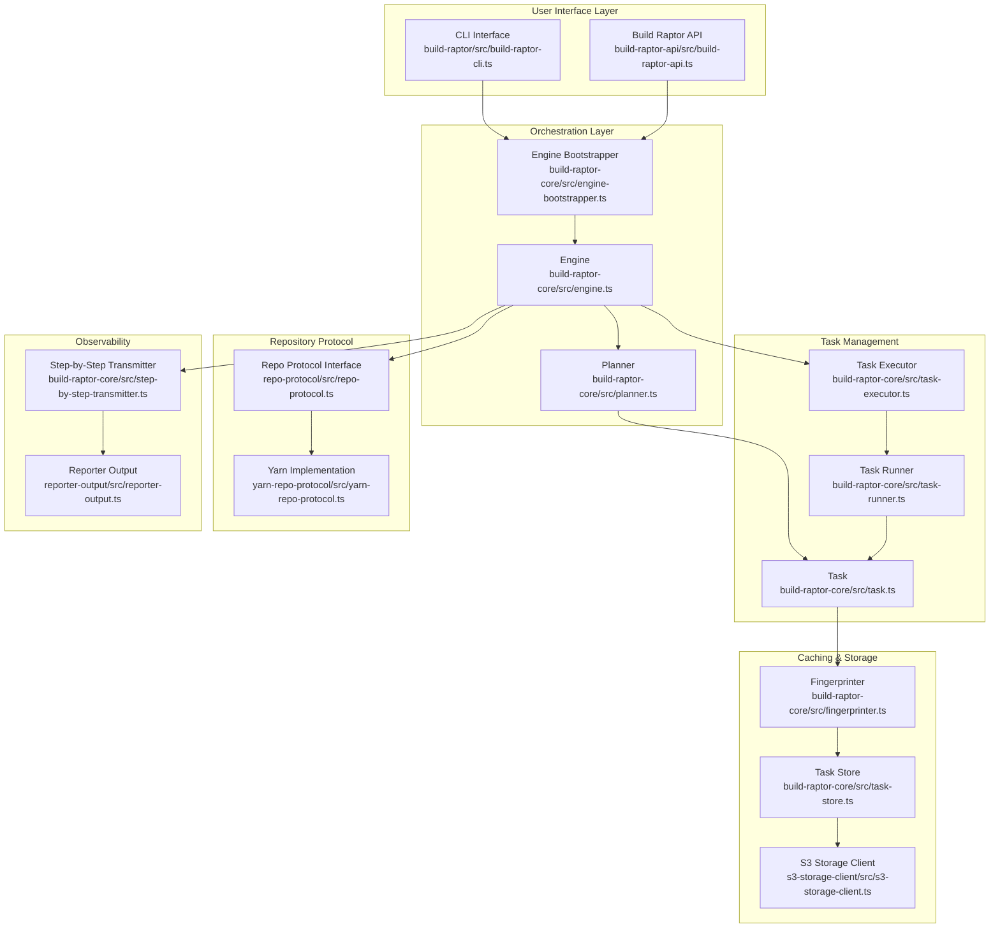

# Build Raptor - System Architecture Overview

## Executive Summary

Build Raptor is a high-performance, cache-optimized monorepo build system designed for TypeScript/JavaScript projects. It achieves dramatic build speedups through content-addressable caching, parallel task execution, and intelligent dependency tracking.

**Core Value Proposition**: Only rebuild what has changed - cache everything else.

## System Architecture Diagram



## Core Concepts

### 1. Task Graph Model

- **Definition**: Build operations are modeled as a directed acyclic graph (DAG) where nodes are tasks and edges are dependencies
- **Key Properties**:
  - Tasks declare inputs (files or other task outputs)
  - Tasks declare outputs (files produced)
  - Tasks can have labels for selective execution
  - Tasks are uniquely identified by `${unitId}:${taskKind}`

### 2. Content-Addressable Caching

- **Fingerprinting**: Each task gets a unique fingerprint based on:
  - Input file contents (not timestamps)
  - Task configuration
  - Dependencies' fingerprints
- **Storage**: Task outputs stored in S3/local cache keyed by fingerprint
- **Cache Hit**: If fingerprint exists in cache, skip execution and restore outputs

### 3. Execution Strategy

- **Parallel Execution**: Tasks run concurrently when dependencies are satisfied
- **Fail-Fast**: Build stops on first failure unless configured otherwise
- **Three-Phase Execution**:
  1. Planning: Build task graph, compute fingerprints
  2. Execution: Run tasks or restore from cache
  3. Reporting: Emit step-by-step events

## Data Flow Patterns

### Build Execution Flow

```yaml
Input:
  - Repository root directory
  - Task selector (units/goals/labels)
  - Configuration file

Processing:
  1. Repository Scanning:
    - Protocol discovers package.json files
    - Extracts build tasks and dependencies

  2. Planning Phase:
    - Construct task graph
    - Topological sort
    - Compute fingerprints

  3. Execution Phase:
    - Check cache for each task
    - Execute uncached tasks
    - Store outputs to cache

  4. Reporting Phase:
    - Emit step-by-step events
    - Generate summary

Output:
  - Task outputs in workspace
  - Cache entries in storage
  - Step-by-step JSON report
```

### Caching Flow

```yaml
Cache Key Generation: Input Files -> SHA256 -> Combined with Task Info -> Final Fingerprint

Cache Operations:
  - PUT: After successful task execution
  - GET: Before task execution
  - Storage: S3 or local filesystem
  - Format: Tar archives of output files
```

## System Boundaries & Integration Points

### External Interfaces

1. **CLI Interface**: `modules/build-raptor/src/build-raptor-cli.ts`

   - Commands: build, test, pack, publish-assets
   - Configuration: `.build-raptor.json`

2. **Storage Interface**: `modules/misc/src/storage-client.ts`

   - Abstraction over S3/local storage
   - Configurable via environment variables

3. **Repository Protocol**: `modules/repo-protocol/src/repo-protocol.ts`

   - Plugin interface for different repo types
   - Current implementation: Yarn workspaces

4. **Step-by-Step Processor**: `modules/build-raptor-api/src/step-by-step-processor.ts`
   - External processors can consume build events
   - Real-time build monitoring and integration

### Internal Module Dependencies

```yaml
Core Dependencies: build-raptor -> build-raptor-core
  build-raptor -> yarn-repo-protocol
  build-raptor-core -> task-store
  build-raptor-core -> fingerprinter
  task-store -> s3-storage-client

Utility Dependencies: All modules -> misc (utilities)
  All modules -> core-types (type definitions)
  All modules -> logger
```

## Architectural Patterns

### 1. Plugin Architecture

- **Pattern**: Strategy pattern for repository protocols
- **Benefits**: Extensible to different monorepo tools (npm, pnpm, rush)
- **Interface**: `RepoProtocol` abstract class

### 2. Event-Driven Reporting

- **Pattern**: Publisher-Subscriber via `TypedPublisher`
- **Benefits**: Decoupled reporting, real-time monitoring
- **Events**: Task lifecycle, cache operations, test results

### 3. Immutable Task Model

- **Pattern**: Immutable data structures for tasks
- **Benefits**: Predictable state, easy debugging
- **Implementation**: Tasks are frozen after creation

### 4. Two-Level Caching

- **Pattern**: Local cache + remote S3 storage
- **Benefits**: Fast local hits, shared team cache
- **Configuration**: Automatic fallback chain

## Performance Characteristics

### Scalability Factors

- **Task Parallelism**: Limited by CPU cores and dependency graph width
- **Memory Usage**: O(n) where n = number of tasks
- **Cache Performance**: O(1) lookups, network-bound for S3
- **File I/O**: Minimized through fingerprinting strategy

### Optimization Strategies

1. **Tight Fingerprints**: Only hash direct inputs, not transitive
2. **Lazy Evaluation**: Tasks computed on-demand
3. **Batch Operations**: Group S3 operations
4. **Local Cache**: Reduces network overhead

## System Constraints & Invariants

### Invariants

1. **Deterministic Builds**: Same inputs always produce same outputs
2. **Task Isolation**: Tasks cannot affect each other except through declared dependencies
3. **Cache Consistency**: Fingerprint uniquely identifies task outputs
4. **DAG Property**: No circular dependencies allowed

### Constraints

1. **File-Based**: All inputs/outputs must be files
2. **Workspace Structure**: Assumes standard monorepo layout
3. **Node.js Runtime**: Requires Node.js environment
4. **Storage Requirements**: Needs persistent storage for cache

## Error Handling & Recovery

### Error Categories

1. **Build Failures**: Task returns non-zero exit code
2. **System Failures**: Out of memory, disk full
3. **Cache Failures**: S3 unavailable, corrupt cache
4. **Configuration Errors**: Invalid config, missing dependencies

### Recovery Mechanisms

- **Partial Builds**: Continue building independent branches
- **Cache Fallback**: Use local cache if S3 fails
- **Detailed Logging**: All operations logged to `.build-raptor/main.log`
- **Task Output Capture**: Stdout/stderr saved per task

## Security Considerations

### Access Control

- **S3 Credentials**: Via AWS SDK credential chain
- **Local Files**: Respects filesystem permissions
- **No Credential Storage**: Never persists credentials

### Data Protection

- **Cache Isolation**: Each repo has separate cache namespace
- **No Code Execution**: Cache contains only build outputs
- **Checksum Validation**: SHA256 verification of cache entries

---

_This document serves as the entry point for understanding Build Raptor's architecture. For detailed subsystem documentation, see the Core Subsystems Guide._
