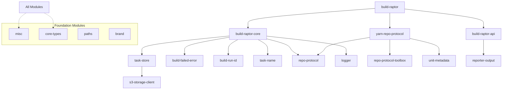

# Build Raptor - Module Reference Catalog

## Module Dependency Graph



---

## Core Modules

### 1. build-raptor

**Purpose**: Main CLI entry point and command orchestration  
**Stability**: Stable  
**Dependencies**: build-raptor-core, yarn-repo-protocol, build-raptor-api  
**Side Effects**: File I/O, Process spawning, Network calls

**Key Exports**:

```typescript
// Main CLI entry point
export class BuildRaptorCli {
  async run(args: string[]): Promise<void>
}

// Available commands
export type Command = 'build' | 'test' | 'pack' | 'publish-assets'
```

**Usage Pattern**:

```bash
# Build all modules
node modules/build-raptor/dist/src/main.js build

# Test with specific labels
node modules/build-raptor/dist/src/main.js test --label=unit

# Pack for deployment
node modules/build-raptor/dist/src/main.js pack
```

**Configuration File**: `.build-raptor.json`

```json
{
  "verbosePrintTasks": ["critical-task"],
  "tightFingerprints": true,
  "repoProtocol": {
    "install": "dormant"
  }
}
```

---

### 2. build-raptor-core

**Purpose**: Core build engine, task orchestration, and caching logic  
**Stability**: Stable  
**Dependencies**: misc, logger, core-types, repo-protocol  
**Side Effects**: Heavy File I/O, Process management

**Key Exports**:

```typescript
export class Engine {
  constructor(
    logger: Logger,
    rootDir: RepoRoot,
    repoProtocol: RepoProtocol,
    taskStore: TaskStore,
    taskOutputDir: string,
    selector: TaskSelector,
    eventPublisher: TypedPublisher<EngineEventScheme>,
    transmitter: StepByStepTransmitter,
    options: EngineOptions,
  )

  async run(): Promise<Breakdown>
}

export class Task {
  readonly name: TaskName
  readonly inputs: readonly PathInRepo[]
  computeFingerprint(fingerprintsOfInputs: Fingerprint[]): void
  assignVerdict(verdict: Verdict, executionType: ExecutionType): void
}

export class Planner {
  async plan(units: Unit[], selector: TaskSelector): Promise<Plan>
}
```

**Invariants**:

- Tasks are immutable after creation
- Fingerprints computed exactly once
- Dependencies resolved before execution

---

### 3. build-raptor-api

**Purpose**: Public API for build events and external integrations  
**Stability**: Stable - Breaking changes require major version  
**Dependencies**: zod  
**Side Effects**: None (pure data structures)

**Event Schema**:

```typescript
export type Step =
  | { step: 'BUILD_RUN_STARTED'; buildRunId: string }
  | { step: 'BUILD_RUN_ENDED' }
  | { step: 'TASK_ENDED'; taskName: string; verdict: Verdict }
  | { step: 'TEST_ENDED'; testPath: string[]; verdict: TestVerdict }
  | { step: 'ASSET_PUBLISHED'; casAddress: string }
// ... more events

export type StepByStepProcessor = (step: Step) => void | Promise<void>
```

**Integration Example**:

```typescript
// Custom processor module
export const processor: StepByStepProcessor = async step => {
  if (step.step === 'TASK_ENDED') {
    await metrics.record(step.taskName, step.verdict)
  }
}
```

---

### 4. yarn-repo-protocol

**Purpose**: Yarn workspace discovery and task extraction  
**Stability**: Stable  
**Dependencies**: repo-protocol, unit-metadata, misc  
**Side Effects**: File system scanning, package.json parsing

**Key Exports**:

```typescript
export class YarnRepoProtocol extends RepoProtocol {
  async scan(): Promise<Unit[]>
  getTaskInfos(unit: Unit): TaskInfo[]
  async install(): Promise<void>
}

export interface BuildTaskRecord {
  inputs?: string[]
  outputs?: string[]
  publicOutputs?: string[]
  labels?: string[]
}
```

**Package.json Extension**:

```json
{
  "buildTasks": {
    "compile": {
      "inputs": ["src/**/*.ts"],
      "outputs": ["dist/**/*.js"],
      "labels": ["build"]
    }
  }
}
```

---

### 5. task-store

**Purpose**: Cache management and storage operations  
**Stability**: Stable  
**Dependencies**: s3-storage-client, misc  
**Side Effects**: Network I/O, File system cache

**Key Exports**:

```typescript
export class TaskStore {
  async get(fingerprint: Fingerprint): Promise<CacheEntry | null>
  async put(task: Task, outputs: string[]): Promise<void>
  async publishAssets(task: Task, files: string[]): Promise<void>
}

export interface CacheEntry {
  fingerprint: Fingerprint
  outputs: Map<string, Buffer>
  metadata: CacheMetadata
}
```

**Cache Strategy**:

- L1: In-memory cache (LRU, 100MB)
- L2: Local disk cache (.build-raptor/cache)
- L3: S3 remote cache

---

### 6. s3-storage-client

**Purpose**: AWS S3 integration for remote caching  
**Stability**: Stable  
**Dependencies**: @aws-sdk/client-s3, misc  
**Side Effects**: Network calls to AWS

**Key Exports**:

```typescript
export class S3StorageClient implements StorageClient {
  constructor(options: S3Options)
  async put(key: string, content: Buffer): Promise<void>
  async get(key: string): Promise<Buffer | null>
}

export interface S3Options {
  bucket: string
  region?: string
  prefix?: string
  credentials?: AWS.Credentials
}
```

**Environment Configuration**:

```bash
BUILD_RAPTOR_S3_BUCKET=my-cache-bucket
AWS_REGION=us-east-1
# AWS credentials via standard AWS SDK chain
```

---

## Foundation Modules

### 7. misc

**Purpose**: Shared utilities and helpers  
**Stability**: Stable - Heavily depended upon  
**Dependencies**: None  
**Side Effects**: Varies by utility

**Key Utilities**:

```typescript
// Hashing
export function computeObjectHash(obj: Jsonable): string

// Async utilities
export class Executor {
  async execute<T>(tasks: Task<T>[]): Promise<T[]>
}

// Collections
export function sortBy<T>(items: T[], key: (item: T) => string): T[]
export function uniqueBy<T>(items: T[], key: (item: T) => string): T[]

// Graph operations
export class Graph<V> {
  addEdge(from: string, to: string): void
  topologicalSort(): string[]
}
```

---

### 8. core-types

**Purpose**: Core type definitions and branded types  
**Stability**: Very Stable - Breaking changes affect entire system  
**Dependencies**: brand  
**Side Effects**: None

**Key Types**:

```typescript
export type PathInRepo = Brand<string, 'PathInRepo'>
export type RepoRoot = Brand<string, 'RepoRoot'>
export type UnitId = Brand<string, 'UnitId'>

// Smart constructors
export const PathInRepo = (s: string): PathInRepo => {
  if (!isValidPath(s)) throw new Error(`Invalid path: ${s}`)
  return s as PathInRepo
}
```

---

### 9. logger

**Purpose**: Structured logging with criticality levels  
**Stability**: Stable  
**Dependencies**: misc  
**Side Effects**: File I/O, Console output

**Key Exports**:

```typescript
export interface Logger {
  print(message: string, criticality?: Criticality): void
  info(message: string, ...rest: unknown[]): void
  error(message: string, error?: Error): void
}

export type Criticality = 'high' | 'moderate' | 'low'

export function createDefaultLogger(options?: LoggerOptions): Logger
```

**Usage Pattern**:

```typescript
const logger = createDefaultLogger({
  outputFile: '.build-raptor/main.log',
  logLevel: 'info',
})

logger.info('Build started', { buildId })
logger.error('Task failed', error)
```

---

### 10. repo-protocol

**Purpose**: Abstract interface for repository protocols  
**Stability**: Stable interface, extensible implementation  
**Dependencies**: core-types  
**Side Effects**: None (interface only)

**Key Abstractions**:

```typescript
export abstract class RepoProtocol {
  abstract scan(): Promise<Unit[]>
  abstract getTaskInfos(unit: Unit): TaskInfo[]
  abstract install(): Promise<void>
}

export interface TaskInfo {
  taskName: TaskName
  command: string
  env?: Record<string, string>
  outputLocations?: OutputLocation[]
}

export interface Unit {
  id: UnitId
  pathInRepo: PathInRepo
  dependencies: UnitId[]
}
```

---

## Specialized Modules

### 11. build-failed-error

**Purpose**: Typed error for build failures  
**Stability**: Stable  
**Dependencies**: None  
**Side Effects**: None

```typescript
export class BuildFailedError extends Error {
  constructor(public readonly failedTasks: string[], public readonly rootCause?: string)
}
```

---

### 12. build-run-id

**Purpose**: Unique identifier generation for build runs  
**Stability**: Stable  
**Dependencies**: uuid  
**Side Effects**: None

```typescript
export type BuildRunId = Brand<string, 'BuildRunId'>
export const BuildRunId = (): BuildRunId => uuid.v4() as BuildRunId
```

---

### 13. task-name

**Purpose**: Task name parsing and manipulation  
**Stability**: Stable  
**Dependencies**: brand  
**Side Effects**: None

```typescript
export type TaskName = Brand<string, 'TaskName'>

export const TaskName = () => ({
  make: (unitId: string, taskKind: string): TaskName => `${unitId}:${taskKind}` as TaskName,

  parse: (name: TaskName): { unitId: string; taskKind: string } => {
    const [unitId, taskKind] = name.split(':')
    return { unitId, taskKind }
  },
})
```

---

### 14. unit-metadata

**Purpose**: Package metadata management  
**Stability**: Stable  
**Dependencies**: core-types  
**Side Effects**: File I/O

```typescript
export interface UnitMetadata {
  name: string
  version: string
  dependencies: Record<string, string>
  devDependencies?: Record<string, string>
  scripts?: Record<string, string>
  buildTasks?: Record<string, BuildTaskRecord>
}

export function readUnitMetadata(path: string): UnitMetadata
```

---

### 15. paths

**Purpose**: Path manipulation utilities  
**Stability**: Stable  
**Dependencies**: None  
**Side Effects**: None

```typescript
export function toAbsolute(root: string, path: string): string
export function isSubpath(parent: string, child: string): boolean
export function relativeTo(from: string, to: string): string
```

---

### 16. brand

**Purpose**: Branded/opaque type utilities  
**Stability**: Very Stable  
**Dependencies**: None  
**Side Effects**: None

```typescript
export type Brand<BaseType, BrandName> = BaseType & {
  readonly [brandSymbol]: BrandName
}

// Creates branded type without runtime overhead
export function brand<T, B>(value: T): Brand<T, B> {
  return value as Brand<T, B>
}
```

---

### 17. reporter-output

**Purpose**: Build report generation and formatting  
**Stability**: Stable  
**Dependencies**: misc  
**Side Effects**: File I/O

```typescript
export interface BuildReport {
  summary: BuildSummary
  tasks: TaskReport[]
  timeline: TimelineEvent[]
}

export function generateReport(breakdown: Breakdown): BuildReport
export function writeReportToFile(report: BuildReport, path: string): void
```

---

### 18. repo-protocol-toolbox

**Purpose**: Utilities for implementing repository protocols  
**Stability**: Evolving  
**Dependencies**: repo-protocol, misc  
**Side Effects**: File I/O

```typescript
export function generateTaskInfos(unit: Unit, packageJson: PackageJson): TaskInfo[]

export function resolveWorkspaceGlobs(root: string, patterns: string[]): string[]
```

---

### 19. build-raptor-core-testkit

**Purpose**: Testing utilities for build-raptor  
**Stability**: Test-only, can change  
**Dependencies**: build-raptor-core  
**Side Effects**: Creates temp directories

```typescript
export class TestDriver {
  async setupRepo(structure: RepoStructure): Promise<void>
  async runBuild(selector?: TaskSelector): Promise<Breakdown>
  async assertTaskExecuted(taskName: string): Promise<void>
}
```

---

### 20. build-raptor-jest-reporter

**Purpose**: Jest reporter integration for build events  
**Stability**: Stable  
**Dependencies**: build-raptor-api  
**Side Effects**: Emits build events

```typescript
export class BuildRaptorReporter implements JestReporter {
  onTestResult(test: Test, result: TestResult): void
}
```

---

## Module Semantic Annotations

### Stability Levels

- **Very Stable**: Breaking changes require major version bump
- **Stable**: Changes are backwards compatible
- **Evolving**: API may change in minor versions
- **Test-only**: Can change freely, not for production

### Side Effect Categories

- **None**: Pure functions/data structures
- **File I/O**: Reads/writes local filesystem
- **Network**: Makes network calls
- **Process**: Spawns child processes
- **Heavy**: Significant CPU/memory usage

### Dependency Rules

1. Foundation modules cannot depend on feature modules
2. Protocol implementations depend on protocol interfaces
3. Test modules can depend on any module
4. Circular dependencies are forbidden

---

_This catalog provides comprehensive module documentation for AI tools. For integration examples, see the Integration & Extension Guide._
